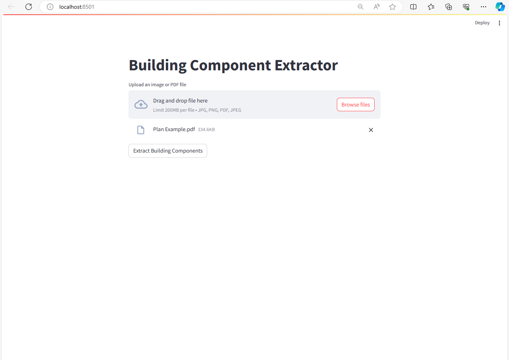

# Building Component Extractor

Building Component Extractor is a Streamlit web application designed to extract dimensions and calculate volumes of building components from uploaded images or PDF files containing building plans. It utilizes image processing techniques to analyze the input and provide detailed information about the building components.

## Features

- Upload images or PDF files containing building plans.

- Extract dimensions and calculate volumes of building components.

- Display the extracted data in a structured format.

- Simple and intuitive user interface.
video here how its work 
[text](video.mkv)
## Dependencies

- Python 3.x
- Streamlit
- OpenCV (cv2)
- NumPy
- Pandas
- pdf2image

## Installation

1. Clone the repository:

git clone https://github.com/SardarAwais88/building_volume_calculator_streamlit.git

2. Install dependencies:

Python 3.x
- Streamlit
- OpenCV (cv2)
- NumPy
- Pandas
- pdf2image
pip install streamlit opencv-python numpy pandas pdf2image

## Usage

1. Run the Streamlit app:

streamlit run app.py

2. Upload an image or PDF file containing the building plan.
3. Click on the "Extract Building Components" button to start the extraction process.
4. View the extracted dimensions and volumes in the output section.

## Contributing

Contributions are welcome! Feel free to open issues or pull requests for any improvements or bug fixes.

## License

This project is licensed under the MIT License - see the [LICENSE](LICENSE) file for details.
